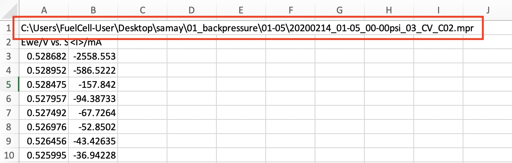
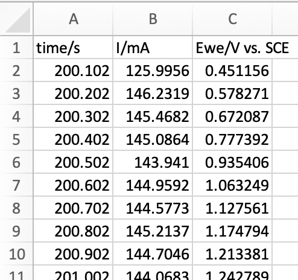
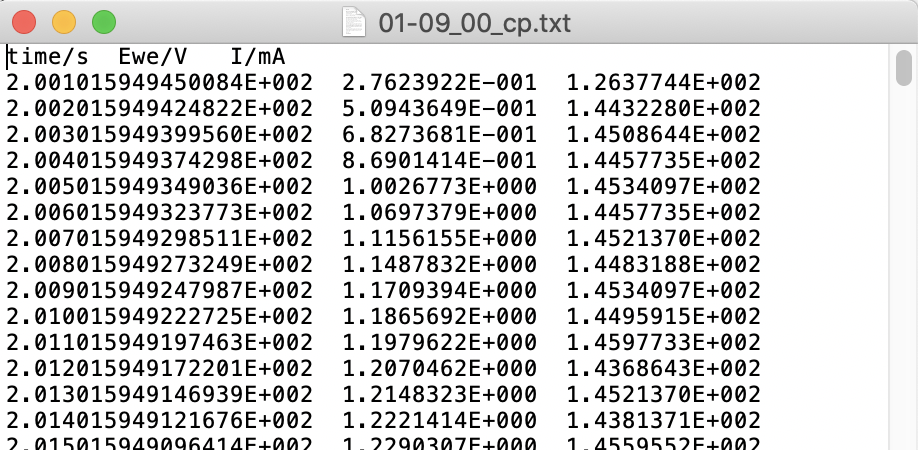

## Setup

There are two different versions of the program: One for Mac and one for Windows; download the version that will work on your operating system. The program should be able to run as-is without downloading anything else. It may take a minute or two to launch, especially the first time, but this is normal.

## Preprocessing

Very minimal preprocessing of the data is required to ensure the program works correctly. 

### File type

The program is currently able to read  delimited text, Microsoft Excel (xls and xlsx), and CSV files. 

### File naming

Ensure that the abbreviation for the type of experiment which was run appears somewhere in the filename. For example, if the data are from a chronopotentiometry experiment, 'cp' should be in the file name somewhere; if the data were from a linear sweep voltammetry experiment, 'lsv' should be in the file name somewhere; etc.

### File struture

#### Excel and CSV

All data for a particular test should be in a single spreadsheet.

If this text is in the first row of the spreadsheet, delete the first row.

 

If you used EC lab to generate the data, leave the column headings as-is so the program can automatically identify the columns. Otherwise you will need to manually specify the columns. In this case, the column headings and the order of  the columns do not matter. It can be helpful, however, if you maintain your own convention for the order of the columns. Delete any empty columns which may be between columns containing data. Finally, there should only be one column for each variable. This is mainly an issue for CP and CA data, since you might have two time columns; just delete one of them. That's it! 

Example file:

#### Text Files

The file should look similar to the example below; again, the order of the columns doesn't matter, and the column headings can remain as is. I've never had to modify text files in any way after I export them from EC Lab

Example file:

